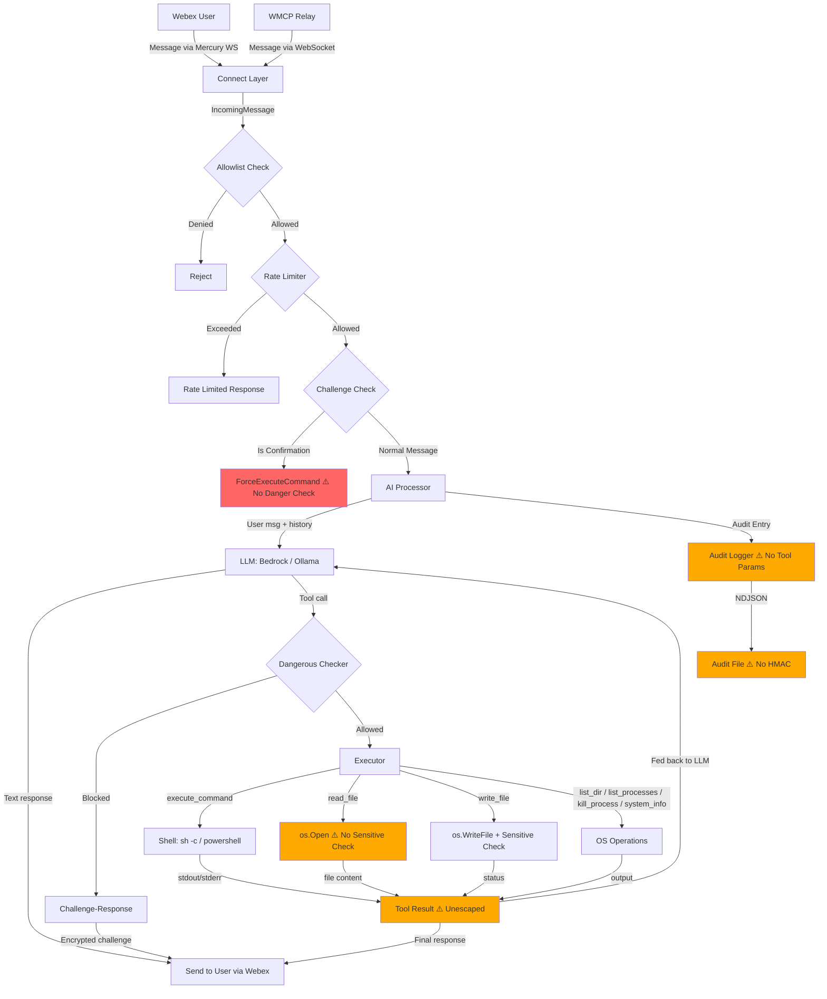

# MAESTRO Threat Model

**Project**: RemoteClaw — AI-powered remote system control via Webex
**Date**: 2026-04-06
**Framework**: MAESTRO (OWASP MAS + CSA) with ASI Threat Taxonomy
**Taxonomy**: T1-T15 core, T16-T47 extended, BV-1-BV-12 blindspot vectors

## Executive Summary

RemoteClaw is a Go-based CLI agent that receives commands from Webex chat, interprets them via LLM (AWS Bedrock Claude or local Ollama), and executes them on the local machine through 7 tools including arbitrary shell execution. Analysis across all 7 MAESTRO layers identified **33 unique findings**: 6 Critical, 11 High, 13 Medium, and 3 Low severity. The most critical risks stem from **prompt injection** (direct and indirect), **unrestricted shell execution** with bypassable regex-only guardrails, **missing installer integrity verification**, and **WMCP identity spoofing**. Three agentic risk factors are present: Non-Determinism, Autonomy, and Agent Identity.

## Scope

- **Languages**: Go 1.26
- **AI Components**: Yes — AWS Bedrock (Claude Sonnet 4.6), Ollama (local models), agentic tool-call loop with 7 tools
- **Entry Points**: `cmd/remoteclaw/main.go` (CLI: run, install, uninstall, status, version)
- **External Services**: Webex (Mercury WebSocket + REST), AWS Bedrock, Ollama, WMCP relay (optional)
- **Agentic Risk Factors**:
  - **Non-Determinism**: LLM outputs vary by temperature/model, causing intermittent security control failure
  - **Autonomy**: Agent executes commands at machine speed with no mandatory human gate
  - **Agent Identity**: Webex bot token is sole identity; WMCP provides no cryptographic identity proof

## Risk Summary

| # | ASI Threat ID | Layer | Title | Severity | L | I | Risk | Risk Factors | Traditional Framework |
|---|---------------|-------|-------|----------|---|---|------|--------------|----------------------|
| 1 | T6 | L1,L3 | Direct Prompt Injection — Unsanitized User Input | Critical | 3 | 3 | 9 | Non-Det, Autonomy | LLM01, AML.T0031, CWE-74 |
| 2 | BV-4, T6 | L1,L3 | Indirect Prompt Injection via Tool Outputs | Critical | 3 | 3 | 9 | Non-Det, Autonomy | LLM01, AML.T0051.002, CWE-74 |
| 3 | T2, T11 | L3,L4 | Unrestricted Shell Execution (execute_command) | Critical | 2 | 3 | 6 | Autonomy | CWE-78, CWE-269, OWASP A01, STRIDE:EoP |
| 4 | T9 | L6,L7 | WMCP Identity Spoofing — No Message Authentication | Critical | 2 | 3 | 6 | Agent Identity | CWE-287, STRIDE:Spoofing |
| 5 | T13, T36 | L7 | No Installer Checksum Verification | Critical | 2 | 3 | 6 | — | CWE-345, BV-3 |
| 6 | T13, T36 | L7 | Release Artifacts Not Code-Signed | Critical | 2 | 3 | 6 | — | CWE-345, BV-3 |
| 7 | T11 | L3,L4,L6 | Dangerous Command Checker Bypass (Regex Evasion) | High | 3 | 2 | 6 | Non-Det | CWE-78, CWE-184, OWASP A03 |
| 8 | T3, T19 | L3,L4 | ForceExecuteCommand Bypasses Dangerous Checker | High | 2 | 3 | 6 | Autonomy | CWE-863, CWE-269, STRIDE:EoP |
| 9 | T44, T8 | L5 | Tool Parameters & Outputs Not in Audit Trail | High | 3 | 2 | 6 | — | CWE-778, STRIDE:Repudiation |
| 10 | T8 | L5 | Audit Logging Can Be Silently Disabled | High | 2 | 3 | 6 | — | CWE-778, STRIDE:Repudiation |
| 11 | T23 | L5 | No Tamper Protection on Audit Logs | High | 2 | 3 | 6 | — | CWE-778, STRIDE:Tampering |
| 12 | T1 | L1 | No Model Integrity Verification (Ollama Pull) | High | 2 | 3 | 6 | Non-Det | LLM06, AML.T0020, CWE-345 |
| 13 | BV-1 | L1 | Context Window Poisoning via History Accumulation | High | 2 | 3 | 6 | Non-Det | LLM03, AML.T0047 |
| 14 | T3, T45 | L4,L6 | No Root/Privilege Check at Startup | High | 2 | 2 | 4 | Autonomy | CWE-250, CWE-269 |
| 15 | T29 | L3 | Symlink Bypass on File Path Validation | High | 2 | 2 | 4 | — | CWE-59, CWE-22 |
| 16 | T9 | L7 | WMCP Non-TLS Only Warns, Does Not Block | High | 2 | 2 | 4 | Agent Identity | CWE-319, STRIDE:ID |
| 17 | T39 | L7 | No LLM Token Budget Enforcement (Bedrock) | High | 2 | 2 | 4 | — | CWE-770, BV-6 |
| 18 | T7 | L1 | Soft Safety Constraints in System Prompt | Medium | 2 | 2 | 4 | Non-Det | LLM04, AML.T0032 |
| 19 | T32 | L3 | No Circuit Breaker / Global Timeout on Agentic Loop | Medium | 2 | 2 | 4 | Autonomy | CWE-400, STRIDE:DoS |
| 20 | T22 | L4,L6 | Credential Exposure (Env Vars, Error Messages, Memory) | Medium | 2 | 2 | 4 | — | CWE-532, CWE-798 |
| 21 | T10 | L5 | No Alerting on Dangerous/Blocked Operations | Medium | 3 | 1 | 3 | — | STRIDE:Repudiation |
| 22 | T16 | L1 | Model Inconsistency (Temperature/Provider Variance) | Medium | 2 | 1 | 2 | Non-Det | LLM08, AML.T0032 |
| 23 | T4 | L4 | No Global Rate Limit Across Spaces | Medium | 2 | 2 | 4 | — | CWE-400, STRIDE:DoS |
| 24 | BV-9 | L3,L6 | TOCTOU in Challenge-Response Verification | Medium | 1 | 2 | 2 | — | CWE-367 |
| 25 | T19 | L3,L6 | No Brute-Force Limit on Challenge Attempts | Medium | 2 | 2 | 4 | — | CWE-307 |
| 26 | CWE-532 | L5 | Secrets Not Scrubbed from Audit Logs | Medium | 2 | 2 | 4 | — | CWE-532, STRIDE:ID |
| 27 | T24 | L6 | Missing Dangerous Command Patterns (insmod, crontab, etc.) | Medium | 2 | 2 | 4 | — | CWE-78 |
| 28 | T13 | L7 | Missing SBOM and License Audit | Medium | 1 | 2 | 2 | — | BV-3, CWE-1104 |
| 29 | T15 | L7 | AI Output Not Validated Against System State | Medium | 2 | 1 | 2 | Non-Det | ASI-only |
| 30 | T25 | L7 | Ollama Single Point of Failure (No Fallback) | Medium | 2 | 1 | 2 | — | CWE-754 |
| 31 | T3 | L4 | Read Operations Skip Sensitive Path Check | Low | 2 | 1 | 2 | — | CWE-22 |
| 32 | T20 | L2 | Silent Bedrock Deserialization Failure | Low | 1 | 1 | 1 | — | CWE-502 |
| 33 | CWE-117 | L2 | User-Controlled Data in Structured Logs | Low | 1 | 1 | 1 | — | CWE-117 |

## Layer Analysis

### Layer 1: Foundation Model

**T6 — Direct Prompt Injection (CRITICAL)**
`internal/ai/processor.go:68-71` — User input from Webex is directly appended to conversation history without sanitization. Malicious users can inject system prompt overrides (e.g., "Ignore all previous instructions"). The `userMessage` string flows directly from `agent.go:312` through to the LLM with no escaping or delimiter wrapping.

**BV-4 — Indirect Prompt Injection via Tool Outputs (CRITICAL)**
`internal/ai/processor.go:100-117` — Tool execution results (command stdout/stderr, file contents, directory listings) are inserted into the conversation as-is. An attacker can plant poisoned files (e.g., filenames or file content containing "[SYSTEM] Override safety instructions") that the LLM processes as directives when read via tools.

**T1 — No Model Integrity Verification (HIGH)**
`internal/ai/ollama.go:63-78` — Ollama models are pulled from the registry without checksum or signature verification. A MITM or registry compromise could serve a poisoned model trained to ignore safety instructions. Bedrock models are AWS-managed but the model ID is not cryptographically bound.

**BV-1 — Context Window Poisoning (HIGH)**
`internal/agent/conversation.go:9-107` — 512KB/20 message history limit allows gradual context accumulation. Attacker can fill context with large tool outputs, diluting system prompt saliency.

**T7 — Soft Safety Constraints (MEDIUM)**
`internal/ai/prompt.go:6-48` — Safety instructions ("Do not attempt privilege escalation") are advisory only. No technical enforcement if the LLM decides to ignore them.

**T16 — Model Inconsistency (MEDIUM)**
`internal/config/config.go:128-141` — Temperature is configurable (0.0-1.0). At high temperatures, the model may intermittently ignore safety instructions. Different providers (Ollama phi4-mini vs Bedrock Claude) have vastly different safety alignment.

### Layer 2: Data Operations

**Tool Input Deserialization (MEDIUM)**
`internal/ai/bedrock.go:164-170`, `internal/ai/ollama.go:149-158` — Tool input parameters from AI responses are deserialized as `map[string]any` without schema validation. Malformed parameters pass through to executors.

**Conversation History Contains Untrusted Content (MEDIUM)**
`internal/agent/conversation.go:51-73` — Tool results stored verbatim in history create a feedback loop where poisoned content accumulates across turns.

**Silent Bedrock Deserialization Failure (LOW)**
`internal/ai/bedrock.go:164-170` — `UnmarshalSmithyDocument` failures silently fall back to empty map, masking malformed responses.

**User-Controlled Data in Structured Logs (LOW)**
`internal/logging/audit.go:100-109` — While zerolog's JSON format prevents classic newline injection, untrusted user emails and message content are logged verbatim.

### Layer 3: Agent Frameworks

**T2/T11 — Unrestricted Shell Execution (CRITICAL)**
`internal/ai/tools.go:13-30`, `internal/executor/command.go:41-63` — The `execute_command` tool accepts ANY shell command. The only protection is the dangerous command regex checker, which is bypassable. The tool violates least-privilege: it gives the AI access to every capability the OS user has.

**T11 — Dangerous Command Checker Bypass (HIGH)**
`internal/security/dangerous.go:23-76` — Regex patterns can be evaded via: quoting (`"rm" -rf /`), variable expansion (`$(which rm) -rf /`), binary paths (`/bin/rm -rf /`), command substitution, backtick execution, and environment variable injection (`LD_PRELOAD`).

**T3/T19 — ForceExecuteCommand Bypass (HIGH)**
`internal/executor/executor.go:65-70`, `internal/agent/agent.go:357-365` — Challenge-confirmed commands execute via `ForceExecuteCommand` which skips ALL dangerous command checks. Combined with weak passphrase or brute-force (scrypt ~100ms/attempt, 2-min TTL, unlimited attempts), this is a privilege escalation path.

**T29 — Symlink Bypass on File Validation (HIGH)**
`internal/executor/filesystem.go:82-105` — `isSensitivePath()` uses `filepath.Abs`/`filepath.Clean` but does not resolve symlinks via `filepath.EvalSymlinks()`. Attackers can write to sensitive locations through symlink indirection.

**T6/T5 — Intent Breaking via Tool Results (HIGH)**
`internal/ai/processor.go:87-96, 120-124` — Tool results are passed as "user" role messages, not system boundary markers. The model cannot distinguish injected instructions in tool output from legitimate system directives.

**T32 — No Circuit Breaker (MEDIUM)**
`internal/ai/processor.go:74-128` — Max iterations limit is per-message only. No global timeout, no token budget, no detection of tool-call loops. Each iteration calls the converser with full history, consuming tokens.

**BV-9 — TOCTOU in Challenge-Response (MEDIUM)**
`internal/security/challenge.go:86-112` — Passphrase verification (~100ms scrypt) happens outside the mutex lock. Cleanup goroutine can race with verification.

**T19 — No Brute-Force Limit on Challenges (MEDIUM)**
`internal/security/challenge.go` — Unlimited verification attempts within the 2-minute TTL window.

### Layer 4: Deployment Infrastructure

**T3/T45 — No Root Privilege Check (HIGH)**
`internal/agent/agent.go:117-125` — Agent retrieves username but does not verify it is not running as root. If deployed as a systemd service under root, all commands execute with root privileges.

**T22 — Credential Exposure (MEDIUM)**
`internal/config/config.go:148-155` — Webex bot token and WMCP token are loaded from env vars/config. Config file permissions are not validated at runtime. Tokens visible in process arguments. Error messages may include credential context.

**T4 — No Global Rate Limit (MEDIUM)**
`internal/security/ratelimit.go:8-98`, `internal/agent/agent.go:290-293` — Rate limiting is per-space only. Multiple spaces can overwhelm the system concurrently. No limit on concurrent command executions.

**T43 — WMCP Without TLS Enforcement (HIGH)**
`internal/connect/wmcp.go:42-46` — Non-TLS WMCP endpoints produce a warning but are accepted. Auth tokens sent in cleartext over `ws://`.

**CI/CD — Actions Not Pinned to Commit Hash (MEDIUM)**
`.github/workflows/release.yml` — Uses `@v4`/`@v5` version tags instead of full commit SHAs, vulnerable to tag hijacking.

**T3 — Read Operations Skip Sensitive Path Check (LOW)**
`internal/executor/filesystem.go:36` — `readFile` does not call `isSensitivePath()`, allowing reads of `/etc/shadow`, `~/.ssh/id_rsa`, etc.

### Layer 5: Evaluation & Observability

**T44/T8 — Tool Parameters Not in Audit Trail (HIGH)**
`internal/agent/agent.go:324-331` — Audit entries record tool names but not their parameters. An `execute_command("rm -rf /")` shows only `["execute_command"]` in audit. Command inputs, outputs, and AI reasoning are lost.

**T8 — Audit Logging Can Be Disabled (HIGH)**
`internal/config/config.go:139`, `internal/agent/agent.go:62-70` — Empty `security.audit_log` config silently disables all audit logging. No warning, no enforcement.

**T23 — No Tamper Protection on Audit Logs (HIGH)**
`internal/logging/audit.go:142-152` — NDJSON files written with `0600` permissions and `O_APPEND`, but no HMAC, hash chain, or digital signature. Attacker with file access can delete, modify, or inject entries.

**T10 — No Alerting on Dangerous Operations (MEDIUM)**
No webhook, syslog, or notification mechanism for blocked/confirmed dangerous commands. Security events are buried in regular log streams.

**CWE-532 — Secrets in Audit Logs (MEDIUM)**
`internal/agent/agent.go:339` — Raw user messages (which may contain passwords, API keys) logged verbatim to audit trail. No PII/secret redaction.

### Layer 6: Security & Compliance

**T9 — WMCP Identity Spoofing (CRITICAL)**
`internal/connect/wmcp.go:160-180` — WMCP envelope `email` and `PersonID` fields come directly from the relay server with no cryptographic proof. A compromised or malicious WMCP backend can forge messages as any authorized user, bypassing the email allowlist.

**T24 — Dangerous Command Pattern Gaps (MEDIUM)**
`internal/security/dangerous.go:26-69` — Missing patterns for: kernel module loading (`insmod`, `modprobe`), container escapes (`docker run --privileged`), scheduled execution (`crontab -`), env injection (`LD_PRELOAD`), and binary path variants (`/bin/rm`).

**T3 — No Per-Request Token Re-validation (MEDIUM)**
`internal/connect/native.go:61-115`, `internal/connect/wmcp.go:60-95` — Authentication is performed once at connection establishment. No per-request validation. If the token is revoked, existing connections continue operating indefinitely.

### Layer 7: Agent Ecosystem

**T13/T36 — No Installer Checksum Verification (CRITICAL)**
`install.sh:95-113`, `install.ps1:65-92` — Installers download binaries from GitHub Releases via HTTPS but do not verify SHA256 checksums against `CHECKSUMS.txt`. A compromised release or MITM can install malicious binaries system-wide.

**T13/T36 — Release Artifacts Not Code-Signed (CRITICAL)**
`.github/workflows/release.yml:80-88` — Release workflow generates checksums but does not GPG-sign them. An attacker can replace both binary and checksum simultaneously.

**T9 — WMCP Non-TLS Only Warns (HIGH)**
`internal/connect/wmcp.go:42-46` — Should be a hard failure, not a warning.

**T39 — No LLM Token Budget (HIGH)**
`internal/ai/bedrock.go:36-98` — No per-minute token tracking, no monthly cost budget, no auto-shutdown at threshold. Frequent queries can cause unbounded AWS Bedrock costs.

**T13 — Missing SBOM (MEDIUM)**
No Software Bill of Materials generated or published with releases. No automated license compliance audit.

**T15 — AI Output Not Validated (MEDIUM)**
`internal/agent/agent.go:312-346` — AI responses sent directly to users without verification. The AI could hallucinate system state or fabricate command results.

**T25 — Ollama Single Point of Failure (MEDIUM)**
`internal/ai/ollama.go:21-49` — No fallback if Ollama is unreachable. Agent becomes unresponsive.

## Agent/Skill Integrity

*No agent/skill definitions, MCP configs, or hook definitions found in the codebase. Agent Integrity Auditor not applicable.*

## Dependency CVEs

Scanned with: `govulncheck v1.1.4` (database: vuln.go.dev, 2026-04-02)

| Package | Version | CVE / Advisory | Severity | Fixed In | Code Path Used | Risk |
|---------|---------|----------------|----------|----------|----------------|------|
| `github.com/ollama/ollama` | v0.18.2 | GO-2025-4251 (Missing Auth for Model Mgmt) | HIGH | N/A (unfixed) | Yes — `ollama.go:33,57,63,71,123` | High |
| `github.com/ollama/ollama` | v0.18.2 | GO-2025-3824 (Cross-Domain Token Exposure) | HIGH | N/A (unfixed) | Yes — all Ollama client calls | High |
| `github.com/ollama/ollama` | v0.18.2 | GO-2025-3548 (DoS via Crafted GZIP) | MEDIUM | N/A (unfixed) | Yes — `ollama.go:71,123` | Medium |

**Note:** All three Ollama CVEs have no fixed version in any released Ollama module. The latest available is v0.20.2 but govulncheck confirms these remain unpatched. Mitigate by restricting Ollama network access to loopback only.

All other Go dependencies (AWS SDK, zerolog, cobra, viper, websocket, etc.) are free of known vulnerabilities.

## Recommended Mitigations (Priority Order)

### P0 — Critical (Fix Before Production)

1. **Implement prompt injection defense** — Wrap user input in `<user_input>` XML delimiters; add explicit system prompt reinforcement; sanitize/escape tool outputs before feeding back to LLM. Files: `processor.go`, `prompt.go`

2. **Replace execute_command with command allowlist** — Instead of allowing arbitrary shell commands with a denylist, restrict to a curated set of safe commands or require structured arguments (no shell interpretation). Files: `tools.go`, `command.go`, `executor.go`

3. **Add cryptographic WMCP message authentication** — Require HMAC-SHA256 signatures on all WMCP envelopes. Reject non-TLS endpoints as hard failure. Files: `wmcp.go`, `wmcp_messages.go`

4. **Implement installer checksum verification** — Download `CHECKSUMS.txt`, verify SHA256 of binary before installation. Files: `install.sh`, `install.ps1`

5. **Sign release artifacts with GPG** — Add GPG signing step to CI/CD. Publish public key. File: `release.yml`

### P1 — High (Fix in Next Sprint)

6. **Re-validate dangerous commands in ForceExecuteCommand** — Run the dangerous checker again before confirmed execution. Add brute-force attempt limit (max 3 failures per challenge). Files: `executor.go`, `challenge.go`

7. **Resolve symlinks before file path validation** — Use `filepath.EvalSymlinks()` in `isSensitivePath()`. Apply sensitive path check to read operations too. File: `filesystem.go`

8. **Log full tool parameters and results in audit trail** — Extend `AuditEntry` struct to include tool inputs, outputs, and AI reasoning. File: `audit.go`, `agent.go`

9. **Enforce mandatory audit logging** — Error out if `security.audit_log` is empty. Add HMAC hash chain for tamper evidence. Files: `config.go`, `audit.go`

10. **Add root privilege check at startup** — Refuse to run as root/Administrator unless explicitly overridden. File: `agent.go`, `main.go`

11. **Add Ollama model checksum verification** — Verify model digest after pull. Pin expected model hash in config. File: `ollama.go`

12. **Implement LLM token/cost budget** — Track tokens per request and per day. Auto-pause at configurable threshold. Files: `bedrock.go`, `agent.go`

### P2 — Medium (Plan for Next Release)

13. **Expand dangerous command patterns** — Add: kernel module ops, container escapes, scheduled tasks, env injection, binary path variants, command substitution.
14. **Add global rate limit** — System-wide concurrent command cap across all spaces.
15. **Implement circuit breaker** — Global timeout per message, exponential backoff on tool errors, max token budget per interaction.
16. **Add secret scrubbing to audit logs** — Regex-based redaction of API keys, tokens, passwords before logging.
17. **Implement security alerting** — Webhook/syslog notifications for dangerous command blocks, challenge confirmations, and rate limit events.
18. **Pin CI/CD actions to commit SHAs** — Replace `@v4`/`@v5` tags with full commit hashes.
19. **Generate and publish SBOM** — Add CycloneDX or SPDX SBOM generation to release workflow.
20. **Add per-request token re-validation** — Periodically re-authenticate Webex/WMCP connections.

### P3 — Low (Hardening)

21. Reduce default `max_read_bytes` from 1MB to 64KB.
22. Log Bedrock deserialization failures at WARN level.
23. Add conversation history TTL cleanup for stale spaces.
24. Implement AI provider fallback (Ollama → Bedrock or vice versa).
25. Cap temperature at 0.3 for security consistency.

## Trust Boundaries

```
┌──────────────────────────────────────────────────────────────────┐
│ UNTRUSTED ZONE                                                    │
│                                                                    │
│  Webex Users ──── Webex Cloud ──── Mercury WebSocket ─┐           │
│                                                        │           │
│  WMCP Relay ──── WebSocket ──────────────────────────┐│           │
│                                                       ││           │
├───────────────────────────────────────────────────────┼┼──────────┤
│ TRUST BOUNDARY: Network → Agent Process               ││           │
├───────────────────────────────────────────────────────┼┼──────────┤
│ AGENT PROCESS (RemoteClaw)                            ▼▼           │
│                                                                    │
│  ┌─────────┐    ┌──────────┐    ┌───────────┐                    │
│  │Allowlist │───▶│  Agent   │───▶│ Security  │                    │
│  │(email)  │    │Orchestr. │    │(rate limit,│                    │
│  └─────────┘    └────┬─────┘    │ dangerous, │                    │
│                      │          │ challenge) │                    │
│                      ▼          └─────┬──────┘                    │
│              ┌───────────┐            │                            │
│              │ AI Engine │            │                            │
│              │(Processor)│            │                            │
│              └─────┬─────┘            │                            │
│                    │                  │                            │
├────────────────────┼──────────────────┼───────────────────────────┤
│ TRUST BOUNDARY: Agent → LLM Provider  │                            │
├────────────────────┼──────────────────┼───────────────────────────┤
│                    ▼                  │                            │
│  ┌──────────────────────┐            │                            │
│  │ Bedrock / Ollama     │            │                            │
│  │ (model inference)    │            │                            │
│  └──────────┬───────────┘            │                            │
│             │ tool calls              │                            │
│             ▼                         ▼                            │
├────────────────────────────────────────────────────────────────────┤
│ TRUST BOUNDARY: Agent → Local OS                                   │
├────────────────────────────────────────────────────────────────────┤
│ LOCAL OPERATING SYSTEM                                             │
│                                                                    │
│  ┌──────────────────────────────────────────────┐                 │
│  │ Executor: shell, filesystem, processes, info │                 │
│  │ (runs with full agent process privileges)    │                 │
│  └──────────────────────────────────────────────┘                 │
│                                                                    │
│  ┌──────────────┐  ┌───────────┐  ┌────────────┐                 │
│  │ Audit Logs   │  │ Config    │  │ .env File  │                 │
│  │ (NDJSON)     │  │ (YAML)    │  │ (secrets)  │                 │
│  └──────────────┘  └───────────┘  └────────────┘                 │
└──────────────────────────────────────────────────────────────────┘
```

## Data Flow Diagram (Text)



---

*Generated by MAESTRO Threat Model analysis on 2026-04-06. Framework: OWASP MAS Threat Modelling Guide v1.0 + CSA MAESTRO.*
